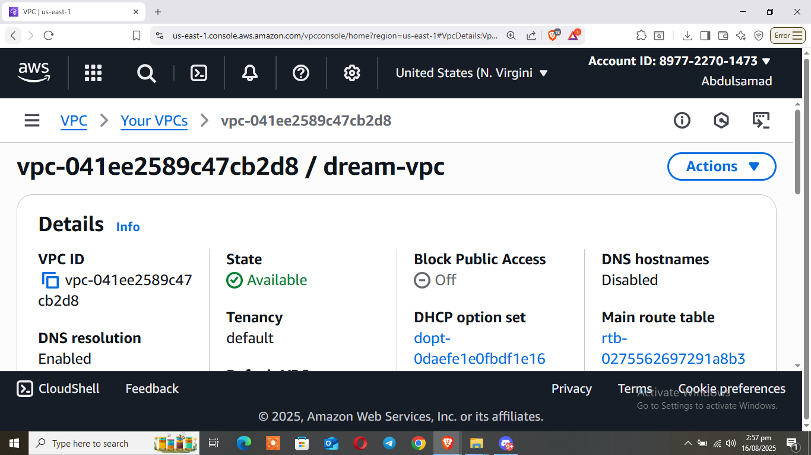
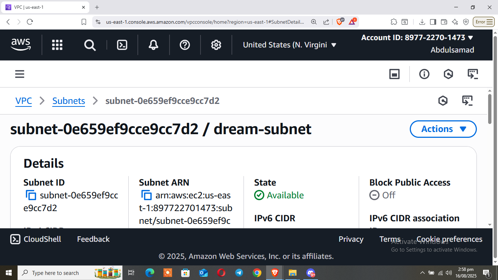
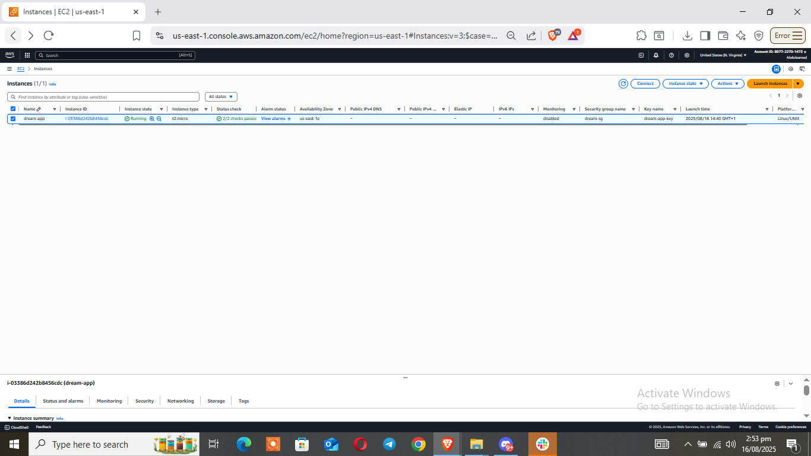
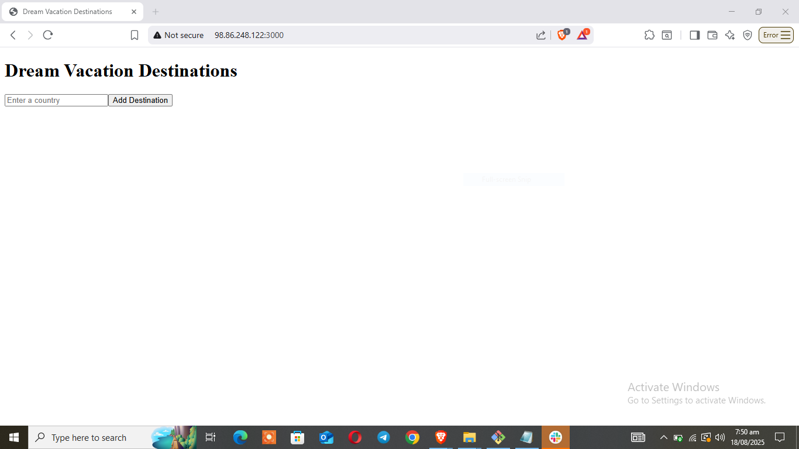
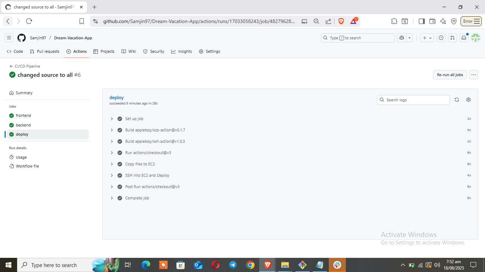

# Dream Vacation App CI/CD Pipeline

This repository demonstrates a **complete CI/CD pipeline** for the Dream Vacation App using GitHub Actions and AWS.  
The pipeline automates linting, Docker image building, Docker Hub publishing, and deployment to an AWS EC2 instance using Docker Compose.

---

## CI/CD Workflow Overview

The single `ci-cd-pipeline.yml` workflow performs the following steps:

1. **Linting**  
   - Runs GitHub Super Linter on JavaScript files (frontend + backend)

2. **Docker Build & Push**  
   - Builds Docker images for both frontend and backend using Buildx  
   - Tags each image with the short Git commit SHA (e.g., `abc1234`)  
   - Pushes the images to Docker Hub  

3. **Deployment**  
   - Connects to AWS EC2 via SSH  
   - Copies `docker-compose.yml`, frontend, and backend code to the server  
   - Runs `docker compose up -d` to update the containers
     
---

## GitHub Secrets Required

| Secret Name            | Purpose                                   |
|------------------------|-------------------------------------------|
| `DOCKERHUB_USERNAME`   | Docker Hub username                       |
| `DOCKERHUB_TOKEN`      | Docker Hub personal access token          |
| `HOST`                 | Public IP/hostname of EC2 instance        |
| `USERNAME`             | SSH username for deployment server        |
| `KEY`                  | Private SSH key for server authentication |
| `POSTGRES_USER`        | Database username                         |
| `POSTGRES_PASSWORD`    | Database password                         |
| `POSTGRES_DB`          | Database name                             |

---

## Screenshots

### 1. VPC in AWS Console

### 2. Subnet in AWS console

### 4. EC2 Instance Running  

### 5. App Running in Browser  

### 6. CI/CD Pipeline Logs – Successful Deployment  

---

## Expected Outcomes

After setting up this CI/CD pipeline:

- Lint checks run automatically on pushes and pull requests  
- Docker images are built and tagged with each commit  
- Tagged images are pushed to Docker Hub  
- EC2 instance automatically updates with the latest changes  
- Application is accessible via the EC2 public IP in the browser  
