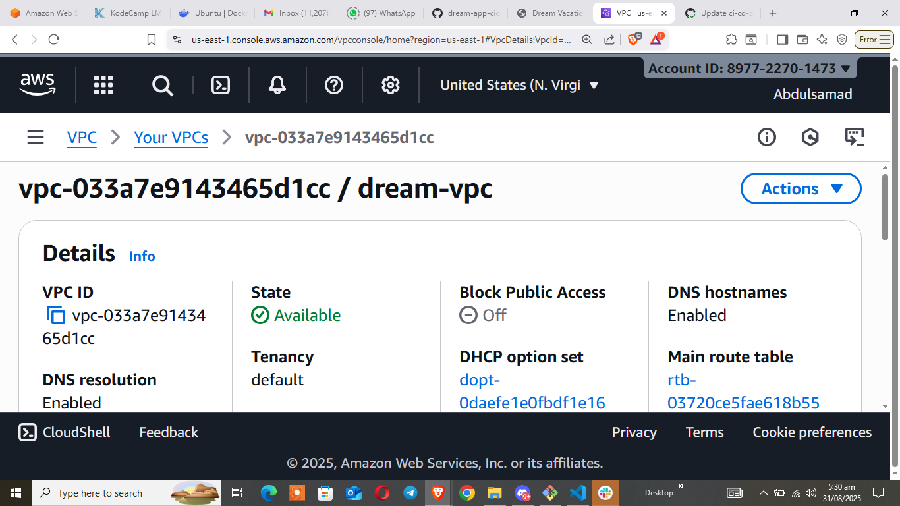
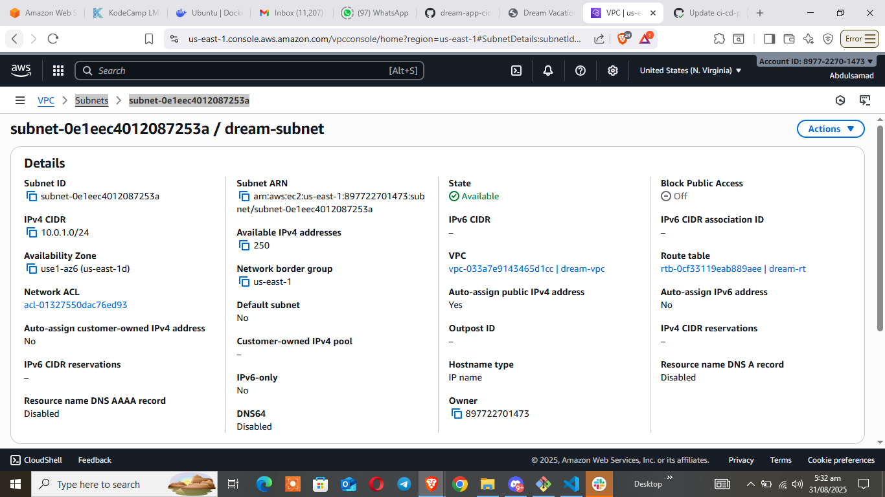
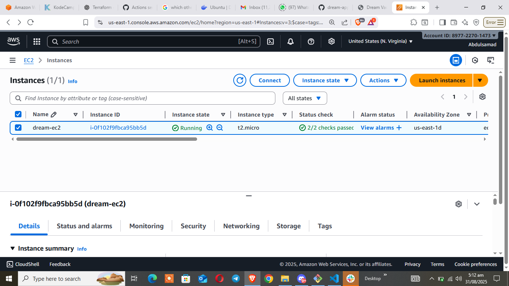
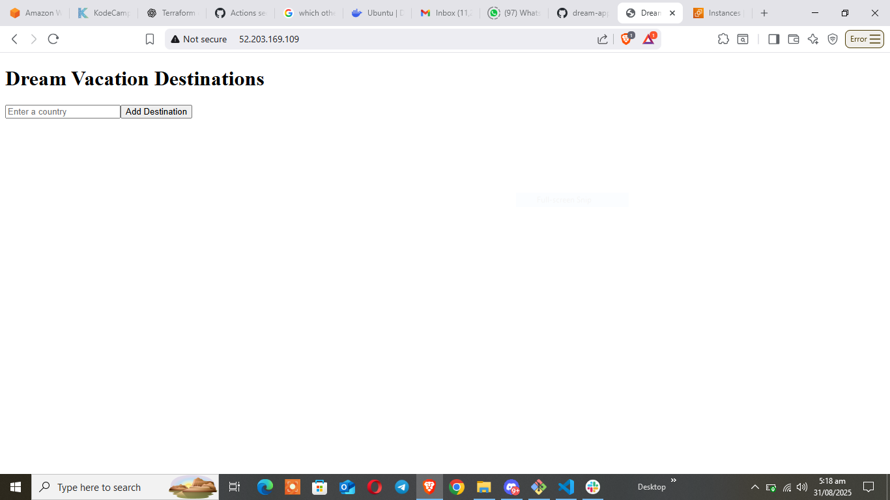
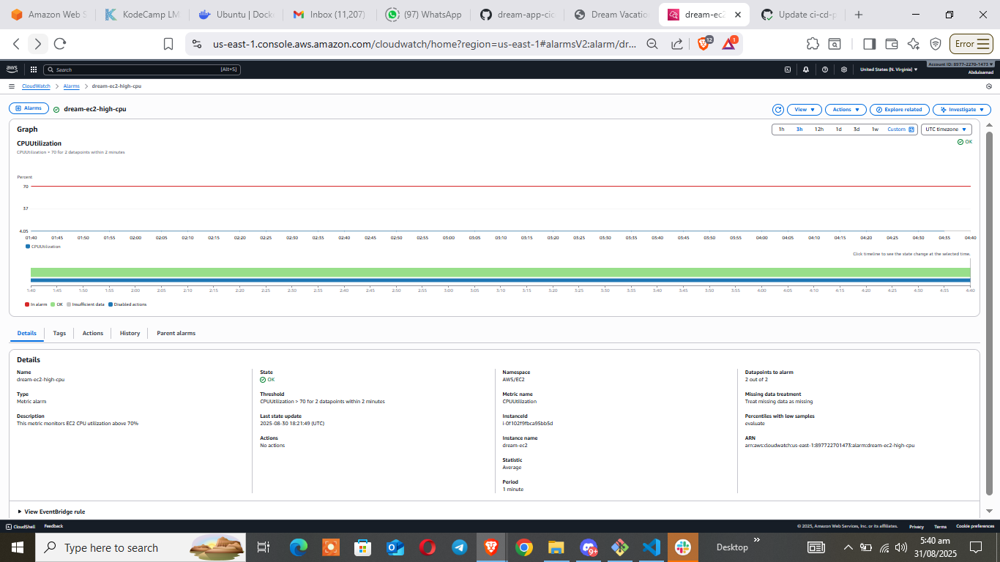
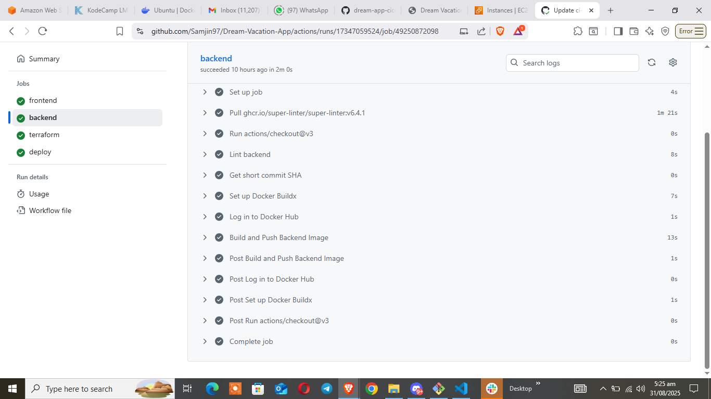
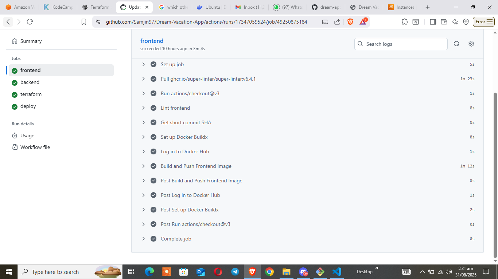
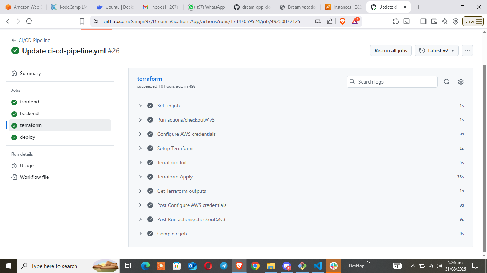
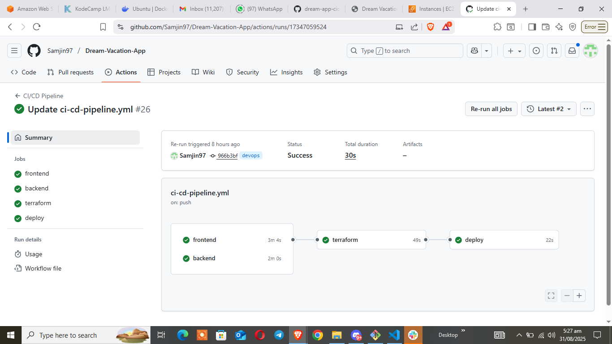

# Dream Vacation App Deployment

## Project Objective
Set up AWS infrastructure with Terraform and deploy the **Dream Vacation App** into an EC2 instance using an existing **CI/CD pipeline**. Configure **CloudWatch monitoring** for CPU utilization.

---

## CI/CD Pipeline Overview

The pipeline automates **build, push, and deployment**:

1. **Frontend Job**
   - Checks out code
   - Runs linter
   - Builds Docker image for frontend
   - Pushes image to Docker Hub

2. **Backend Job**
   - Checks out code
   - Runs linter
   - Builds Docker image for backend
   - Pushes image to Docker Hub

3.  **Terraform Job**
    - Checks out code
    - Configures AWS credentials 
    - Creates an EC2 instance and sets up a cloudwatch

4. **Deploy Job**
   - Checks out full repository
   - SSHs into the EC2 instance
   - Copies `docker-compose.yml` and other app files
   - Pulls the latest Docker images
   - Runs containers with `docker-compose up -d`

---

## Terraform Infrastructure Setup

- **VPC & Networking**
  - VPC: `dream-vpc` (10.0.0.0/16)
  - Subnet: `dream-subnet` (10.0.1.0/24)
  - Internet Gateway: `dream-igw`
  - Route Table: `dream-rt` with default route to IGW
  - Subnet associated with the route table

- **EC2 Instance**
  - Latest Ubuntu LTS (24.04)
  - Instance type: `t2.micro`
  - Security Group: SSH (22) and HTTP (80)
  - Bootstrapped via **user data script**:
    - Installs Docker & Docker Compose
    - Installs CloudWatch Agent to send CPU metrics

- **CloudWatch Monitoring**
  - Alarm triggers if CPU > 70% for 2 consecutive 1-minute periods

---

## Deployment Steps

1. Commit code to the `devops` branch.
2. Pipeline builds Docker images and pushes them to Docker Hub.
3. Terraform Creates AWS EC2 instance
3. EC2 instance receives the files via SSH.
4. Docker Compose runs containers automatically.
5. Monitor CPU metrics in CloudWatch.

---

## Deliverables

### Snippets

**Networking**

```hcl
    resource "aws_vpc" "dream_vpc" {
  cidr_block           = var.vpc_cidr
  enable_dns_support   = true
  enable_dns_hostnames = true
  tags = {
    Name = "dream-vpc"
  }
}

resource "aws_subnet" "dream_subnet" {
  vpc_id                  = aws_vpc.dream_vpc.id
  cidr_block              = var.subnet_cidr
  map_public_ip_on_launch = true
  tags = {
    Name = "dream-subnet"
  }
}

resource "aws_internet_gateway" "dream_igw" {
  vpc_id = aws_vpc.dream_vpc.id
  tags = {
    Name = "dream-igw"
  }
}

resource "aws_route_table" "dream_rt" {
  vpc_id = aws_vpc.dream_vpc.id
  tags = {
    Name = "dream-rt"
  }
}

resource "aws_route" "default_route" {
  route_table_id         = aws_route_table.dream_rt.id
  destination_cidr_block = "0.0.0.0/0"
  gateway_id             = aws_internet_gateway.dream_igw.id
}

resource "aws_route_table_association" "subnet_assoc" {
  subnet_id      = aws_subnet.dream_subnet.id
  route_table_id = aws_route_table.dream_rt.id
}
```

**EC2**

```hcl
########################################
# Security Group
########################################
resource "aws_security_group" "dream_sg" {
  name        = "dream-sg"
  description = "Allow SSH and HTTP"
  vpc_id      = aws_vpc.dream_vpc.id

  ingress {
    description = "Allow SSH"
    from_port   = 22
    to_port     = 22
    protocol    = "tcp"
    cidr_blocks = ["0.0.0.0/0"]
  }

  ingress {
    description = "Allow HTTP"
    from_port   = 80
    to_port     = 80
    protocol    = "tcp"
    cidr_blocks = ["0.0.0.0/0"]
  }

  egress {
    description = "Allow all outbound"
    from_port   = 0
    to_port     = 0
    protocol    = "-1"
    cidr_blocks = ["0.0.0.0/0"]
  }

  tags = {
    Name = "dream-sg"
  }
}

resource "aws_instance" "dream_ec2" {
  ami                    = "ami-0360c520857e3138f"
  instance_type          = "t2.micro"
  subnet_id              = aws_subnet.dream_subnet.id
  vpc_security_group_ids = [aws_security_group.dream_sg.id]
  key_name               = var.key_name

  user_data = file("${path.module}/user_data.sh")

  tags = {
    Name = "dream-ec2"
  }

  iam_instance_profile = aws_iam_instance_profile.cw_instance_profile.name
}
```

**Cloudwatch**

```hcl
# IAM role for CloudWatch Agent
resource "aws_iam_role" "cw_agent_role" {
  name = "cw-agent-role"

  assume_role_policy = jsonencode({
    Version = "2012-10-17",
    Statement = [{
      Action    = "sts:AssumeRole"
      Effect    = "Allow"
      Principal = {
        Service = "ec2.amazonaws.com"
      }
    }]
  })
}

# Attach CloudWatch Agent policy to IAM role
resource "aws_iam_role_policy_attachment" "cw_agent_attach" {
  role       = aws_iam_role.cw_agent_role.name
  policy_arn = "arn:aws:iam::aws:policy/CloudWatchAgentServerPolicy"
}

# IAM instance profile for EC2
resource "aws_iam_instance_profile" "cw_instance_profile" {
  name = "cw-instance-profile"
  role = "cw-agent-role"
}

# CloudWatch alarm for CPU utilization
resource "aws_cloudwatch_metric_alarm" "cpu_high" {
  alarm_name          = "dream-ec2-high-cpu"
  comparison_operator = "GreaterThanThreshold"
  evaluation_periods  = 2
  metric_name         = "CPUUtilization"
  namespace           = "AWS/EC2"
  period              = 60
  statistic           = "Average"
  threshold           = 70

  dimensions = {
    InstanceId = aws_instance.dream_ec2.id
  }

  alarm_description = "This metric monitors EC2 CPU utilization above 70%"
  actions_enabled   = false # change to true + SNS topic if you want notifications
}
```


### Screenshots

  - VPC in AWS Console  
    

  - Subnet in AWS console
    

  - EC2 instance running  
    

  - App running in the browser  
    

  - CloudWatch CPU metrics / alarms  
    

  - GitHub Actions pipeline logs showing successful deployment  
     
    
    

    

    
